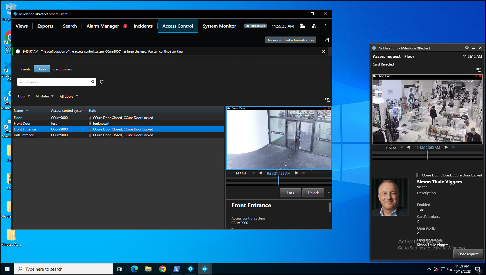

# Access request notifications

Access request notifications are pop-up notifications which appear in front of all other desktop applications for all users logged into the Smart Client with access to view XProtect Access features and devices. These notifications can be customized in the **Access Request Notifications** menu. The XProtect Access integration includes a built-in access request notification.

1. Go to the **Access Request Notification** menu.
2. Click the **Add Access Request Notification** button.
3. Name the new notification.
4. Associate cameras, speakers, microphones, and sounds.
5. Click the **Add Command** button and open the **Command** list to select which commands appear on the notification. 
     
     
6. Open the **Commands** list and choose a type of command, the action the command will perform, and the hardware device to command. 
     
     
7. If the command should interact with a hardware device that is not related to the device which triggered the access request notification, choose **Other** and select from the list of all devices. 
     
     

??? abstract "Extended options"
    When the notification pops up on the desktop a sound will play if you choose to include a sound alert. The built-in access request notification does not include a sound alert.

    Access request notifications can be used to trigger pop up notifications from within the Milestone rules system, and the notifications do not need to be connected to access control hardware devices.

    