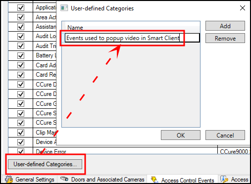
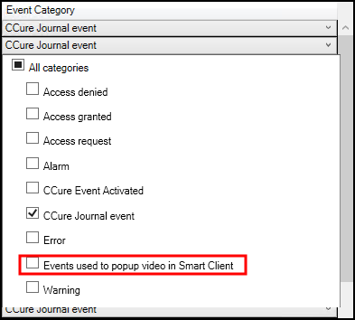
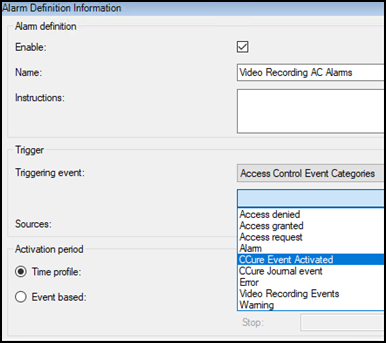
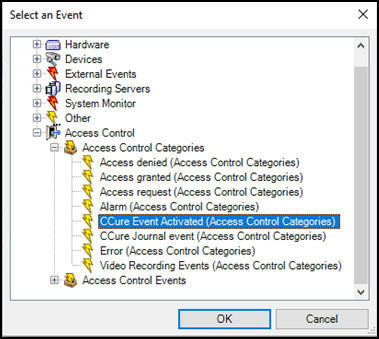

# Categorize events

Large scale access control systems, such as those managed by CCure 9000, need to functionally integrate with XProtect without programming large numbers of individual alarms and rules. Categorizing access control events greatly minimizes the number of individual alarms and rules that need to be programmed.

To generate XProtect alarms or rule-based actions triggered by any one of a group of individual CCure events, the events must be categorized. For example, the integration can be configured to start recording video from associated cameras based on any number of unique hardware events: “Door Forced,” “Denied, Badge Not in Panel,” and “Access Denied Unauthorized Entry Level.” Chosen events are placed in the same category, and then a rule is created to start recording based on the receipt within XProtect Access of any event in that category.

The categories are:

=== "Default XProtect Access Events"     
    + Access granted
    + Access request
    + Access denied
    + Alarm
    + Error
    + Warning

=== "CCure Events"
    + CCure Journal event
    + CCure Event Activated

=== "Custom Events"
    + User-defined category…

***

## Creating a user defined category

1. Go to the **Access Control Events** menu.
2. Click the **User-defined Categories** button to create your own custom event category. 
     
     
3. Click **Add**, name the category, and press **OK**.
4. The user-defined category appears as an option in the **Event Category** list. 
     
     

??? abstract "Trigger alarms and rules with CCure events."
    Alarms and rules in XProtect are triggered using any category of event.

    | Alarm Access Control Categories Event list    | Rule Access Control Categories Event list |
    |-----------------------------------------------|-------------------------------------------|
    |    |     |
