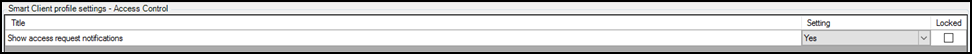
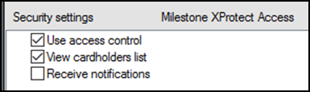

# Client profiles and roles explained

Smart Client profiles and user roles in XProtect allow administrators to control the features available in the XProtect Smart Client.

Smart Client profiles allow control over the visibility of access request notifications. Roles allow control over access control globally, visibility of the cardholder list, and access request notifications. For example, if a user cannot receive access request notifications it could be disabled in both the Smart Client profile that user is assigned, or in their role.

## Managing client profiles and roles

1. To manage Smart Client profiles – open the Management Client. 
    + Expand **Client** and select **Smart Client profiles**.
    + The **Access Control** menu contains the setting for notifications. 
         
         
2. To manage roles open the Management Client. 
    + Expand **Security** and select **Roles**.
    + Select the role to manage and click on the **Access Control** menu to adjust the available settings. 
         
         

!!! glass "Receive notifications?"
    The **Receive notifications** setting is only used to enable notifications with the web client and mobile client.