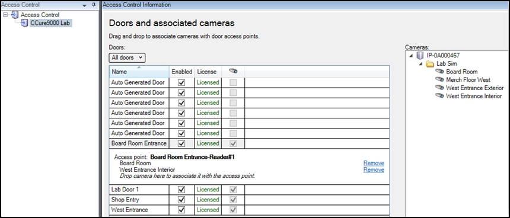

# Door and camera association

In the **Doors and associated cameras** menu of the XProtect Access Instance it is possible to verify the status of all connected doors, and create, reassign, and remove the association between cameras and doors.

Doors require associated cameras to view live and recorded video - and listen to or play audio through any XProtect client application that supports visualization of doors.

1. Open the doors list and select a panel or the **All doors** group to view all doors connected to that panel. 
     
     
2. Click on a door. Under it all associated cameras are listed.
3. Select a camera from the **Cameras** list on the right and drag the selected camera into the list of cameras associated to the chosen door.
4. If required, click the **Remove** link to end the association between the camera and the door.
