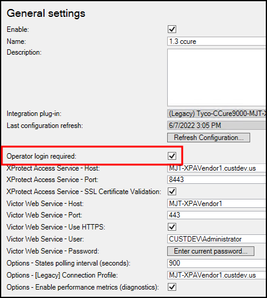
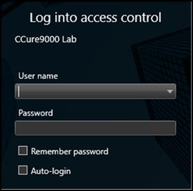
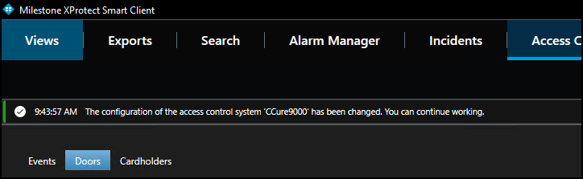
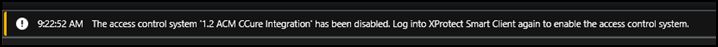

# Personalized login

Personalized login is an optional feature of XProtect Access. When a user logs into XProtect Smart Client, personalized login adds a second login into CCure 9000. The user presents valid CCure 9000 credentials, and the Smart Client features will only work with access control hardware, events, and alarms available to that user’s privileges.

Personalized login manages two configurations. First, is the global configuration used by the Management Client. Second, is the personalized configuration used in the Smart Client. Personalized configurations are subsets of the global configuration. This helps ensure accurate event handling, command execution, etc.

Requirements for Personalized login:

+ XPA CCure 9000 integration version 1.1 or higher.
+ CCure 9000 version 2.8 or higher

Enable/disable Personalized login:

Enabling/disabling personalized login for a specific access control plug-in is done in the Management Client. The option is in the **General settings** menu titled **Operator login required**:

!!! warning "Requirements for personalized login"
    There are special requirements for personalized login which change slightly based upon the version of CCure 9000. Please read the personalized login workaround topic if you want to use this feature.

## Smart Client personalized login

A second login into the access control dialog is required. It occurs immediately after the standard Smart Client login dialog.

After entering the user name and password, XProtect will attempt to validate the credentials against the CCure 9000 system. If **Skip this step** is selected, the Smart Client is opened without using personalized login, and no XProtect Access features are available in the Smart Client. After authentication with CCure 9000, Smart Client loads a personalized configuration. The Smart Client will only display access control information from the user account that logged in during the personalized configuration login dialog. This includes:

+ Alarms related to hardware the user can view in CCure
+ Events related to hardware the user can view in CCure
+ Devices in the map element selector that the user can view in CCure

XProtect personalized login does not specifically include personalized alarm acknowledgment. Rather, as with standard “non-personalized” login, any user can acknowledge any alarm that is visible in the Smart Client. Since alarms will only be visible if the underlying device is in their personalized configuration, users can only acknowledge alarms related to hardware they can see.

## Refreshing personalized configurations

The XProtect Event Server stores personalized configurations for XProtect Smart Client users. Stored personalized configurations are cleared when the Event Server restarts. When the global configuration of the XProtect Access instance is refreshed, the Event Server updates all stored personalized configurations. Log out of the Smart Client and log back in using the personalized configuration to load the updated configuration.

If the global configuration is changed for a user who is currently logged into the Smart Client using the personalized login feature, the Smart Client application will have the following info message displayed.

If the permissions and CCure access rights are included in the change the following message can appear:

If either of these messages appear, simply follow the instructions in the message. Logging out of the Smart Client application and re-authenticating using the personalized login process will always fetch an updated configuration.