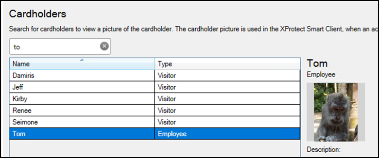

# Searching cardholders

All cardholders in the CCure system are imported from the connected server. Search for cardholders in the **Cardholders** menu of the XProtect Access instance. First Name, Last Name, Badge Numbers, and Cardholder ID are all included in the search. As characters are typed in the box, searching begins across all fields:

Visibility of cardholder information, such as name, badge numbers, etc., is controlled within the CCure database.