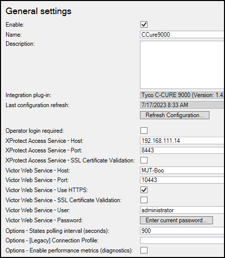

# General settings

Go to the **Access Control** menu in the directory tree of the XProtect Management Client. You can check the status of all instances by selecting the root of the **Access Control** directory.

Click on your CCure 9000 XProtect Access Instance to view or modify the properties of the connection.

A full description of all the properties available is found here: XProtect Access instance connection properties.