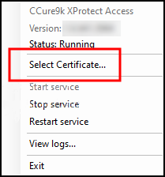
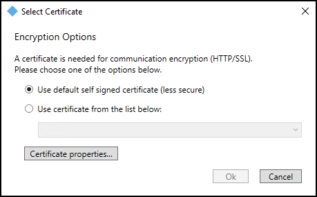
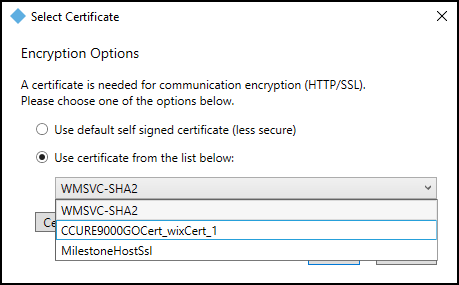

# Encrypting communication between the XProtect Access service and the XProtect Event Server

In the current version of the XProtect Access CCure 9000 integration, there is a tool built into the XProtect Access service to help users manage these certificates. This process shows the steps required.

1. Go to the CCure 9000 server where the XProtect Access service is installed, right click on the XProtect Access service icon in the system tray and choose the **Select Certificate** option from the shortcut menu. 
     
    
2. The **Select Certificate** window will open. There is a self signed certificate available on the server. The self signed certificate is the default selection. 
     
     
3. Choose the type of certificate that meets your security requirements. Milestone recommends using a valid third party certificate if possible as this provides the highest level of security.
4. Select the **Use certificate from the list below** option and open the list to choose from the available certificates. 
     
     
5. Click the **Properties** button to inspect the properties of the chosen certificate. And click **OK** to continue using the selected certificate.
6. Agree to the warning about restarting the XProtect Access service.

??? warning "What if no certificates appear in the list?"
    If the **Select Certificates** window has no available certificates there are several reasons for this, please consult the [No certificates available in Select Certificate window](../Troubleshooting/NoCerts.md) topic.