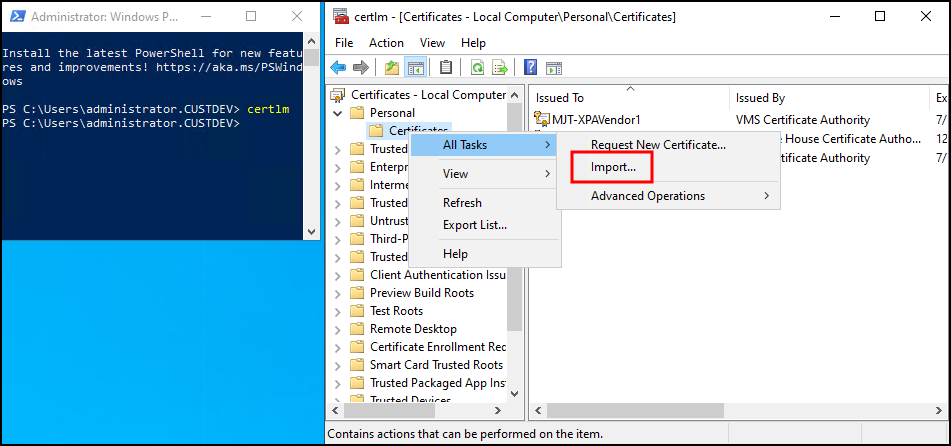

# Encrypting communication between the XProtect Access service and the victor web service

In the current version of the XProtect Access CCure 9000 integration it's possible to encrypt communications between the CCure XProtect Access Service and the victor web service. To do so, install a root certificate on the server that hosts the CCure XProtect Access Service and configure the victor web service to use the certificate. Below are the steps required to install the root certificate and configure the victor web service.

??? warning "3rd party certificates"
    The fully detailed process included here is for self-signed certificates. If you are using a third party certificate, from a commercial certificate provider, please skip ahead to step number ten below. Refer to the XProtect Certificate Guide for any questions on dealing with certificates.

1. On a server with restricted access, open PowerShell and run the script below, to create a CA certificate.</br>
    ```ps1
    # Run this script once, to create a certificate that can sign multiple server SSL certificates
    # Private certificate for signing other certificates (in certificate store)
    $ca_certificate = New-SelfSignedCertificate -CertStoreLocation cert:\CurrentUser\My -DnsName 'VMS Certificate Authority' -KeyusageProperty All `
                                                             -KeyUsage CertSign, CRLSign, DigitalSignature -FriendlyName 'VMS CA Certificate' `
                                                             -TextExtension @("2.5.29.19={critical}{text}ca=TRUE")
    # Thumbprint of private certificate used for signing other certificates
    Set-Content -Path "$PSScriptRoot\ca_thumbprint.txt" -Value $ca_certificate.Thumbprint
    # Public CA certificate to trust (Third-Party Root Certification Authorities)
    Export-Certificate -Cert "Cert:\CurrentUser\My\$($ca_certificate.Thumbprint)" -FilePath "$PSScriptRoot\root-authority-public.cer"
    ```
    </br>
2. By default the script places the new root certificate in the **'C:\'** file location. Move the certificate to the server that hosts the CCure XProtect Access Service.
3. Go to the server that hosts the CCure XProtect Access Service and right-click the certificate and select **Install Certificate** to begin the certificate installation wizard.
4. Choose to place the certificate in the **Store Location** of the **Local Machine**.</br>
    </br>
    </br>
5. Browse and import the certificate in to the **Trusted Root Certification Authorities** folder.</br>
    </br>
    </br>
6. Complete the wizard.
7. Go back to the server with restricted access where you generated the root certificate, open PowerShell and enter the script below to generate a new client certificate to install on the server hosting the victor web service.</br>
    ```ps1
    # Run this script once for each server for which an SSL certificate is needed.
    # Certificate should be executed on the single computer where the CA certificate is located.
    # The created server SSL certificate should then be moved to the server and imported in the
    # certificate store there.
    # After importing the certificate, allow access to the private key of the certificate for
    # the service user(s) of the services that must use the certificate.

    # Load CA certificate from store (thumbprint must be in ca_thumbprint.txt)
    $ca_thumbprint = Get-Content -Path "$PSScriptRoot\ca_thumbprint.txt"
    $ca_certificate = (Get-ChildItem -Path cert:\CurrentUser\My\$ca_thumbprint)

    # Prompt user for DNS names to include in certificate
    $dnsNames = Read-Host 'DNS names for server SSL certificate (delimited by space - 1st entry is also subject of certificate)'
    $dnsNamesArray = @($dnsNames -Split ' ' | foreach { $_.Trim() } | where { $_ })

    if ($dnsNamesArray.Length -eq 0) {
    Write-Host -ForegroundColor Red 'At least one dns name should be specified'
    exit
    }
    $subjectName = $dnsNamesArray[0]
    $dnsEntries = ($dnsNamesArray | foreach { "DNS=$_" }) -Join '&'

    # Optionally allow the user to type in a list of IP addresses to put in the certificate
    $ipAddresses = Read-Host 'IP addresses for server SSL certificate (delemited by space)'
    $ipAddressesArray = @($ipAddresses -Split ' ' | foreach { $_.Trim() } | where { $_ })
    if ($ipAddressesArray.Length -gt 0) {
    $ipEntries = ($ipAddressesArray | foreach { "IPAddress=$_" }) -Join '&'
    $dnsEntries = "$dnsEntries&$ipEntries"
    }

    # Build final dns entries string (e.g. "2.5.29.17={text}DNS=myhost&DNS=myhost.domain.com&IPAddress=10.0.0.103")
    $dnsEntries = "2.5.29.17={text}$dnsEntries"

    # The only required purpose of the sertificate is "Server Authentication"
    $serverAuthentication = '2.5.29.37={critical}{text}1.3.6.1.5.5.7.3.1'

    # Now - create the server SSL certificate
    $certificate = New-SelfSignedCertificate -CertStoreLocation Cert:\CurrentUser\My -Subject $subjectName -Signer $ca_certificate `
    -FriendlyName 'VMS SSL Certificate' -TextExtension @($dnsEntries, $serverAuthentication)

    # Export certificate to disk - protect with a password
    $password = Read-Host -AsSecureString "Server SSL certificate password"
    Export-PfxCertificate -Cert "Cert:\CurrentUser\My\$($certificate.Thumbprint)" -FilePath "$PSScriptRoot\$subjectName.pfx" -Password $password
    
    # Delete the server SSL certificate from the local certificate store
    $certificate | Remove-Item
    ```
8. You will need to enter the PC name of the server hosting the victor web service, the IP address of the server, and a certificate password of your own choosing during the process of completing the script. Enter this information and complete the script.
9. By default the script generates the certificate at the **'C:\'** file location. Copy the file and move it to the server hosting the victor web service.</br>
    </br>
    </br>
10. Go to the server hosting the victor web service and run the certificates snap-in for the local machine. Right-click the **Certificate** store within the **Personal** folder and choose to **Import** a new certificate.</br>
    </br>
    </br>
11. Import the certificate into the store of the local machine. Choose the certificate file that you copied to the local server. Enter the password chosen during the script. Browse to the personal folder of the certificate store to choose that as the location for the certificate. Complete the import wizard.
12. The final step in this process involves binding the certificate to the IIS server supporting the victor web service. In the **IIS Manager** application on the victor web service host server, open the Bindings... menu of the **Default Web Site**.</br>
    </br>
    </br>
13. Choose to edit the https binding, select the imported certificate from the **SSL certificate** list, click **OK** and close the **Site Bindings** menu.</br>
    </br>
    </br>
14. Now the solution is ready for secure communications between the CCure XProtect Access Service and the victor web service.

??? abstract "Learn more"
    For more information about configuring the CCure 9000 system and the victor web service for secure communications refer to the victor Web Service User Guide available from Johnson Controls.


