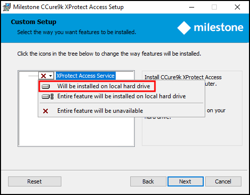
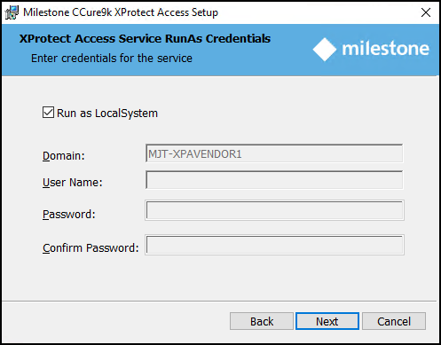

# CCure9k XProtect Access Service installation on an integration server

!!! glass "Installation topology"
    The process documented here is for installing the XProtect Access Service on an integration server - according to this topic: CCure 9000: Alternate configuration.

1. Go to the integration server, locate the required .msi file to start the installation wizard. The required file is named:
    + **XProtectAccess.CCure9k.msi** 
2. Double-click the installation file. Click **Next** to begin the wizard.
3. At the Custom Setup step of the wizard expand the XProtect Access Service option and select Will be installed on local hard drive to install the CCure XProtect Access Service. 
     
     
    
    !!! abstract "Why the red X?"
        By default, none of the components of the integration will be selected for install. Also, there may be other components listed as available to install at this step. The XProtect Access Service component is the only one that should be installed.
   
4. At the **XProtect Access Service RunAs Credentials** step, the default option **Run as LocalSystem** is selected. Continue with this option, or enter the credentials of an administrative user with access to both XProtect and CCure. Click **Next** to continue. 
     
     
5. Click **Install** to install the CCure XProtect Access Service.
6. Finish the installation wizard.