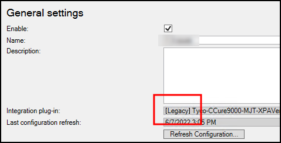
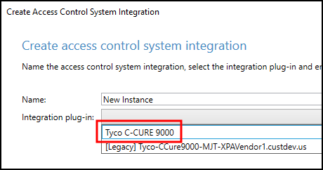

# MIP Plugin upgrades

??? warning "CCure 9000 Upgrades?"
    Currently the two most updated CCure 9000 versions require different licenses compared to all older versions. These versions are:</br>
    
    + 2.90 SP6
    + 3.00.1
    
    Upgrading to either of these versions while running an older version of the integration (1.3 or below), requires first upgrading the integration to the current version (1.4) before upgrading the CCure software.

Always upgrade both the CCure 9000 integration components on the CCure 9000 machine, and the MipPlugin software on the XProtect server. Milestone distributes all component installers with each CCure 9000 XProtect Access integration release. Simply run the installer program on both the CCure 9000 server and the XProtect server; it will upgrade any installed software.

Automatic MipPlugin upgrades of configured and installed instances in the Management Client are also supported for all versions of the CCure 9000 XProtect Access integration.

??? warning "Preserve the old installation directory"
    When upgrading to version 1.3 or 1.4 or higher of the integration, from all versions prior to 1.3, it is required that the file directories where the integration files from the old version were stored are not deleted, before or after the integration is upgraded. Below is the directory for the old integration files:

    ```C:\ProgramData\VideoOS\ACMServers```

After upgrading the integration, any previous versions of the XProtect Access instance in the XProtect Management Client will have the **[Legacy]** label added to it. This simply identifies an upgraded XProtect Access instance.



Any new XProtect Access instances which are added to the same XProtect system have the option to choose between the new version and the **[Legacy]** version during the instance creation wizard. New instances should always choose the version which is labled:

+ **Tyco C-CURE 9000**

