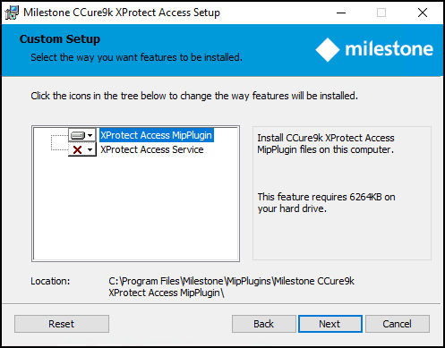

# Milestone Server: Installing the CCure9k XProtect Access MipPlugin

??? abstract "Management Server or Event Server?"
    In most scenarios, the Milestone XProtect Management Server host server is where this component is installed. However, it is technically required to install this component on the server that hosts the XProtect Event Server.

1. Go to the XProtect Event Server host and locate the required .msi file. The required file is named:
    + **XProtectAccess.CCure9k.msi** 
2. Double-click the installation file, and click **Next** to begin.
3. At the **Custom Setup** step choose to install the **XProtect Access MipPlugin** and click **Next** to continue. 
     
     
4. Click **Install** to complete the plugin installation wizard.