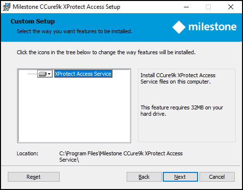

# CCure9k XProtect Access Service installation

!!! glass "Stand-alone server or distributed?"
    The process documented here is for when you are installing the XProtect Access Service on the CCure 9000 server. If you are installing the XProtect Access Service on a separate server you will need to consult the CCure9k XProtect Access Service installation on an integration server topic.

1. Go to the CCure 9000 server, locate the required .msi file to start the installation wizard. The file name is:
    + **XProtectAccess.CCure9k.msi** 
2. Double-click the installation file. Click **Next** to begin the wizard.
3. At the Custom Setup step of the wizard choose to install the CCure XProtect Access Service. 
     
     
4. At the **XProtect Access Service RunAs Credentials** step, the default option of **Run as LocalSystem** is used, or remove this option to enter a user name and password for the service. Click **Next** to continue. 
     
     
5. Click **Install** to install the CCure XProtect Access Service.
6. Finish the installation wizard.