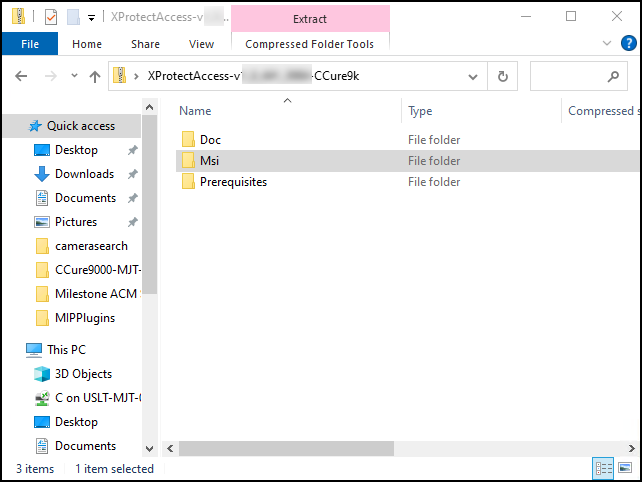

# Installation package

1. Download the most recent version of the CCure 9000 XProtect Access integration from the following location: 
    [XPA CCure Download Site](https://download.milestonesys.com/ccure9kxpa/) 
2. Unzip the installation package. 
    + The installation package consists of a single installer in the MSI folder, a folder for documentation, and a folder for prerequisites. 
     
     
3. Open the MSI folder to find the **XProtectAccess.CCure9k.msi** installer program for both the XProtect and CCure 9000 systems.

!!! glass "Component versions must match!"
    It is mandatory that the same version of the CCure 9000 XProtect Access integration software components are installed on both the XProtect and CCure 9000 machines.