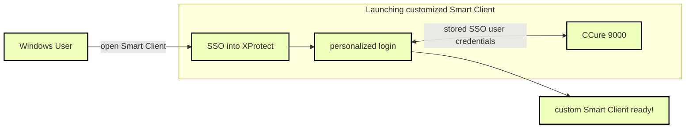

# XProtect Access and SSO authentication (explained)

XProtect single sign-on (SSO) does not delegate SSO to the CCure system. XProtect SSO uses the logged in Windows user, and it cannot automatically present that same user to CCure for authentication. The personalized login feature of XProtect Access is how XProtect presents unique credentials for authentication with CCure.

These personalized login credentials can match a user with SSO in CCure. They can even be the same user logged into Windows who is launching the Smart Client. However, the credentials must be entered at the first login of the Smart Client, and re-entered if the credentials are changed in CCure. Then a user can log into Windows, launch the Smart Client, which automatically authenticates with XProtect via SSO. At this point the stored credentials for the personalized login user that matches the XProtect user are presented to CCure and the CCure user's configuration is loaded into the Smart Client. This can all be done without manually presenting any credentials to XProtect or CCure.

This is the closest to a true SSO user experience that the XProtect Access integration offers. It requires using the personalized login feature. If this feature isn't used, all authentication to CCure from XProtect Access uses the same user credentials that the CCure XProtect Access Service uses to refresh and fetch the configuration from CCure. To utilize this partial SSO user experience with customized privileges, it's important to link XProtect users and roles directly to the appropriate SSO users within CCure.