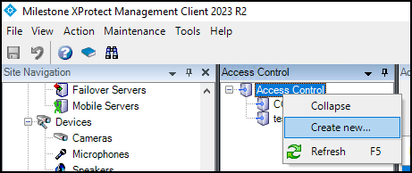
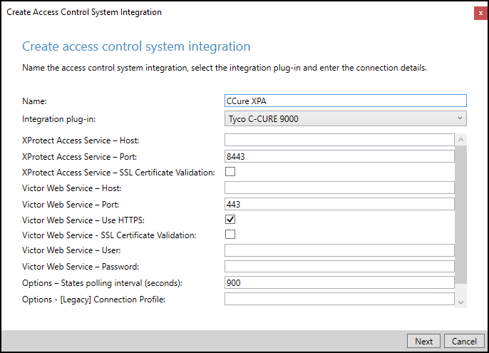
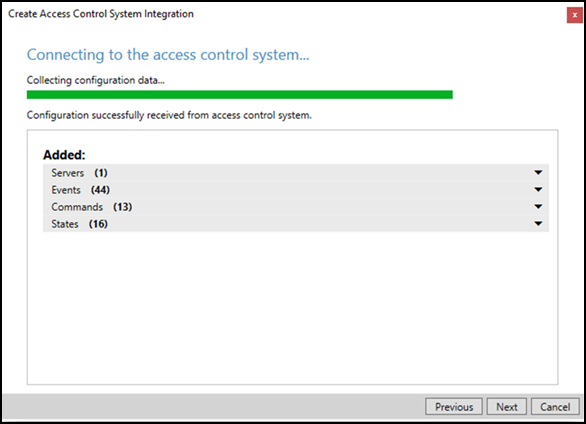
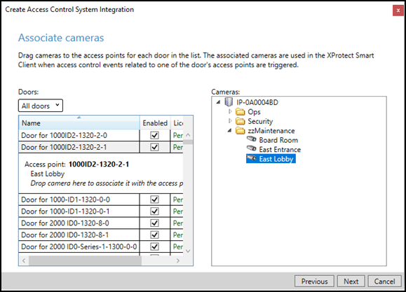

# Creating XProtect Access instance & establishing connection to CCure 9000

Once the CCure XProtect Access Service and the MIP Plugin are installed and configured the XProtect Access (XPA) instance can be created in the Management Client.

1. Go to the **Access Control** menu in the **XProtect Management Client**.
2. Right click on the **Access Control** root node in the **Access Control** pane and choose **Create new…** from the shortcut menu. 
     
     
3. The XProtect Access instance creation wizard begins.
4. Enter a **Name** for the plug-in and select the CCure 9000 plug-in from the list. 
    + The plug-in is named Tyco C-CURE 9000. After selecting the plug-in, you will have to provide credentials and parameters to configure the connection to the CCure 9000 victor web service.
    + The credentials and parameters required are listed here: XProtect Access instance connection properties: 
     
    {width=60%} 
5. The wizard will connect to the CCure 9000 system and fetch the configuration into Milestone. This includes servers, controllers, doors, card holders, events, commands, states, etc. 
     
    {width=60%} 
6. Once the configuration has been fetched, continue the setup wizard. The wizard provides the option to link doors and cameras. This link configures which cameras are displayed when viewing real-time door alarms and events, and when viewing live or recorded video associated to doors.
7. For each link, drag a camera from the camera tree on the right, and place it under a door on the left to create the association. 
     
    {width=60%} 
8. Complete the wizard to finish creating the XProtect Access instance.
