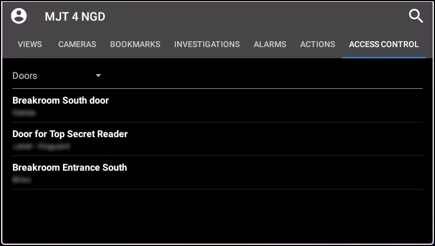
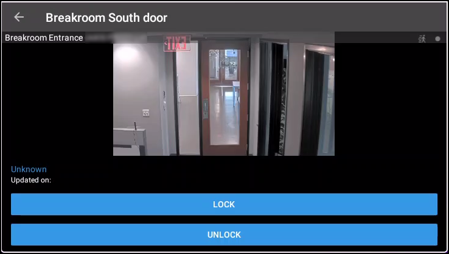
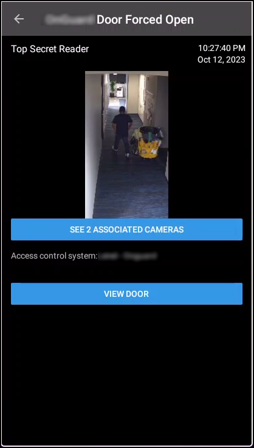

# XProtect Mobile

XProtect Mobile is a smartphone app that connects to your VMS system. The XProtect Access CCure 9000 Integration adds functionality to XProtect Mobile.  Using XProtect Mobile, it is possible to receive a push notification from the access control system, view live video related to the notification, and open the door – all remotely from a smartphone.

## Access control tab in XProtect Mobile

1. Log into the VMS with XProtect Mobile. The **Views** tab is presented by default.
2. Select the **Access Control** tab. 
     
     
3. The **Access Control** tab shows the list of doors available.
4. Filter for specific doors or select a door to view cameras associated to that door and interact with commands available for the selected door. 
     
     
5. Swipe to switch between cameras when multiple cameras are associated to a door.
6. Switch between Doors, Events, and Access Requests.
7. Select an event from the event list to view still images associated to the event and playback video related to the event. Filter the event list. 
     
    

??? warning "Access requests not working!"
    Access requests are only visible if the Smart Client profile assigned to the role of the current user includes the ability to view access requests.