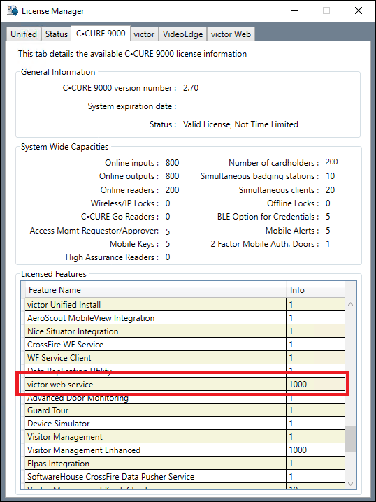

# CCure 9000: licenses explained

??? warning "Corporate license?"
    The CCure 9000 license required to integrate with Milestone XProtect is “Milestone XProtect Corporate” or "Milestone - XProtect Corporate - Integration." This doesn't mean that the only XProtect product that integrates with CCure 9000 is XProtect Corporate. XProtect Corporate, XProtect Expert, and XProtect Professional+ VMS products from Milestone are all tested and supported

Licenses required for CCure 9000 are subject to change based on the version of software installed. There are two different types of integration licenses that could be used to enable the CCure XProtect Access integration.

1. [Milestone XProtect Corporate - SDK license](../Prereqs/CC9KLic.md#ccure-9000-sdk-license)
2. [Milestone - XProtect Corporate - Integration - web service API license](../Prereqs/CC9KLic.md#ccure-9000-web-service-api-license)

Both of these licenses will work. However, only the current version of the XProtect Access integration (1.4) is compatible with the web service API license. Also, there is only one version of the CCure 9000 software that is both compatible with XProtect Access and requires the web service API license - version 3.00.1. Older versions of the integration are not compatible with any version of CCure that is 3.00.1 or higher.

There are three different product SKUs used to order the integration based on the size of the CCure system (the number of readers). These license options apply to all versions of CCure 9000. This applies to both the SDK license and the web service API license.

| License SKU   | Description   |
|---------------|---------------|
| CC9-MSTVD-SM  | CCure 9000 Milestone XProtect Corporate Web Service Integration Small, Series L to N (0-64 readers)   |
| CC9-MSTVD-MD  | CCure 9000 Milestone XProtect Coporate Web Service Integration Medium, Series P to R (65-999 readers) |
| CC9-MSTVD-LG  | CCure 9000 Milestone XProtect Corporate Web Service Integration Large, Series RP to T (1000+ readers) |

XProtect Access uses a permanent connection to the CCure 9000 victor web service (to receive statuses and events) and uses extra connections for specific user operations, such as fetching configuration and executing commands. For optimal operation of XProtect Access, the feature license activated in CCure must support enough concurrent connections to the victor web service to handle the number of XProtect Access permanent and transient connections.

!!! glass "victor web service license"
    The victor web service is a requirement for the XProtect Access integration with CCure 9000. However, this licensed option is typically included.

## CCure 9000 web service API license

In CCure 9000 version 3.00.1 the license requirements change. The only required license is:

+ **Milestone - XProtect Corporate - Integration**

This is a web service API license, therefore it includes the victor web service component. 

!!! glass "How to tell the different licenses apart?"
    The web service API license must display the available concurrent connections for the web service. [0/10] 
     
    {width=60%}

## CCure 9000 SDK license

There are two feature licenses required in CCure when the SDK license is being used.

1. “Milestone XProtect Corporate” - this is an SDK license required for the integration. 
     
    {width=40%} 
2. “victor web service” - this license enables the web server functionality to communicate with XProtect Access. 
     
    {width=40%} 
