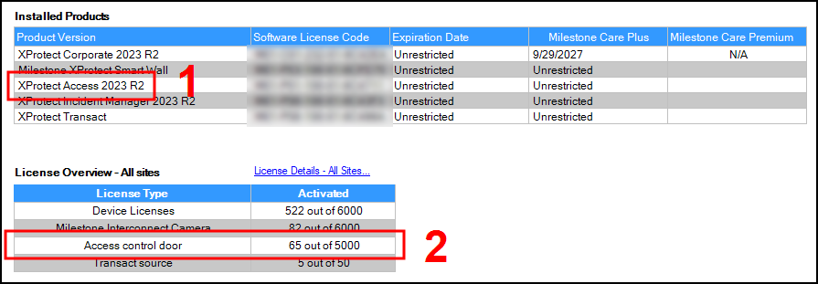
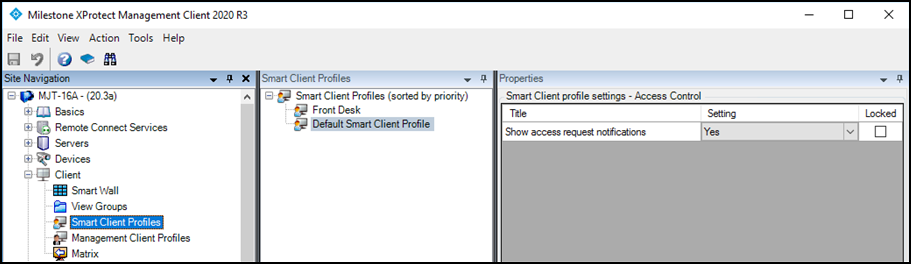

# Required system configurations

Below is a list of configurations which must be applied and in place prior to the integration between CCure 9000 and XProtect. 

## Time synchronization

All servers (i.e. the CCure 9000 and Milestone server operating systems) must be time-synchronized to within a couple of minutes of one another.

## .NET framework: Installation on CCure 9000 server machine

.NET Framework 4.7.2 must be installed on the CCure 9000 server machine (**NDP472-KB4054530-x86-x64-AllOS-ENU.exe**). Any version newer than Windows 10 April 2018 Update and Windows Server version 1803 includes this component. Milestone recommends that you use Microsoft Windows Server Editions of the OS.

## CCure 9000: victor web service installation

The CCure victor web service must be installed and configured on the CCure 9000 server. Please follow the Victor Web Service User Guide provided by CCure. The CCure 9000 victor web service installer can be obtained by downloading the “CCURE 9000 v2.XX Web Service Package” from the CCure download site, or installing it from the CCure 9000.ISO installation package used to install the access control system.

## CCure 9000: victor web service SSL configuration

The SSL configuration must be set up for the CCure 9000 plugin to work (a certificate must be provided and configured in IIS for the CCure 9000 victor web service to accept secure HTTPS connections on port 443). See the CCure 9000 XProtect Access integration looking for secure connection with victor web service troubleshooting topic for more details.

## Milestone XProtect®: license options

The customer must have XProtect Access enabled (1) and the appropriate number of doors (2) in their XProtect SLC.  See the management client license screen for more details.

## XProtect Smart Client profiles

All Smart Client profiles used in the system need to include:

+ **Access Control – Show access request notifications = Yes**

Yes, is the default configuration for all Smart Client profiles. This configuration controls if users receive access request notifications with the Smart Client.

## Milestone XProtect Event Server machine DNS / name resolution

The Milestone XProtect Event Server must have network name resolution with the computer name of the CCure 9000 Server (e.g. DNS, manual host file entry, etc). The CCure 9000 Server machine must also resolve the Milestone server.