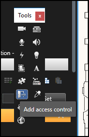
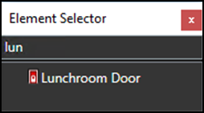
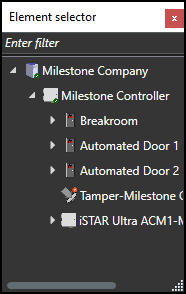
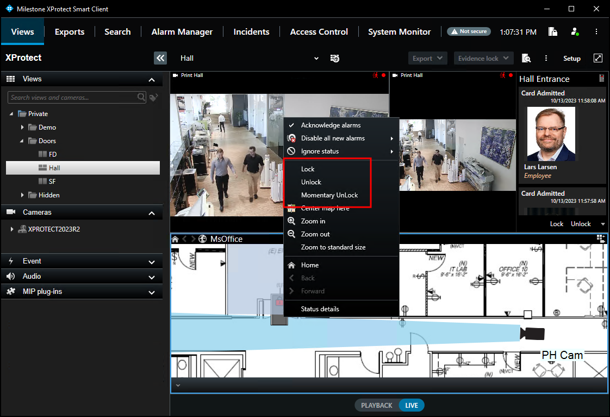
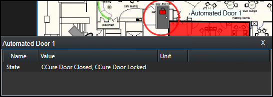
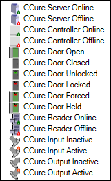

# Maps

It is possible to place doors, readers, inputs, outputs, panels, and CCure server(s) on an existing Smart Client map. The map icons display hardware status as well as execute commands.

1. With the Smart Client in setup mode a **Tools** window will appear in the view pane.
2. From this window, select the **Add access control** option, which is an icon that looks like a door: 
     
     
3. The **Element Selector** window will appear. 
     
     
4. Type the name of a hardware device into the filter to quickly find a device or expand the servers and panels to find all available hardware icons in the system. 
     
     
5. Drag the selected icon onto the map. During normal operations, it is possible to right-click on any of these icons to execute the commands from the shortcut menu. 
     
    {width=75%} 
6. Right-click the device icon and select **Status Details** from the shortcut menu to view more information. The pop-up window contains all the device status information in the **Value** field. 
     
    

!!! glass "Icon status display"
    The map icons have been redesigned to include more possible status information. If you want to know what all of the possible hardware items and status options are refer to the [Map icon hardware and status details](../SCFeatures/Maps.md#map-icon-hardware-and-status-details) topic.

## Map icon hardware and status details

There are several different types of access control map icons that can be displayed on the standard Smart Client map. Each different type of icon represents a specific type of hardware device. Visual indicators appear on these hardware icons to display the current status of the devices they represent. The different types of hardware and status are listed in the image below.

There is a lot of functionality built into the map feature of the XProtect Smart Client, if you want to review all of the functionality available please refer to the maps section of the Smart Client user guide.

??? abstract "Controller tamper status"
    Controllers provide status information to XProtect Access to support display of tamper alarms on those device icons. For supported controllers, a red alarm status ring will appear on the icon when it is being tampered with. When the controller physically returns to a safe state, the alarm status will disappear from the icon.