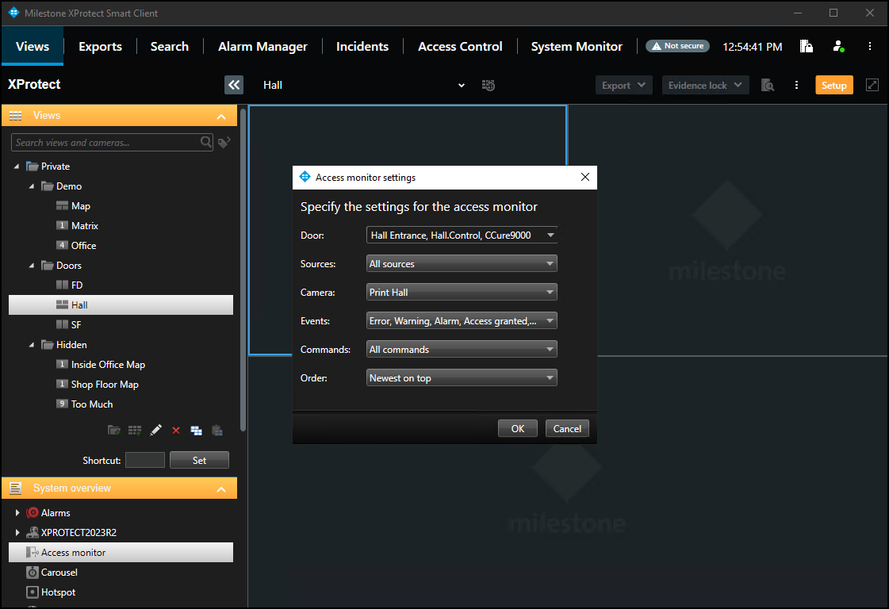
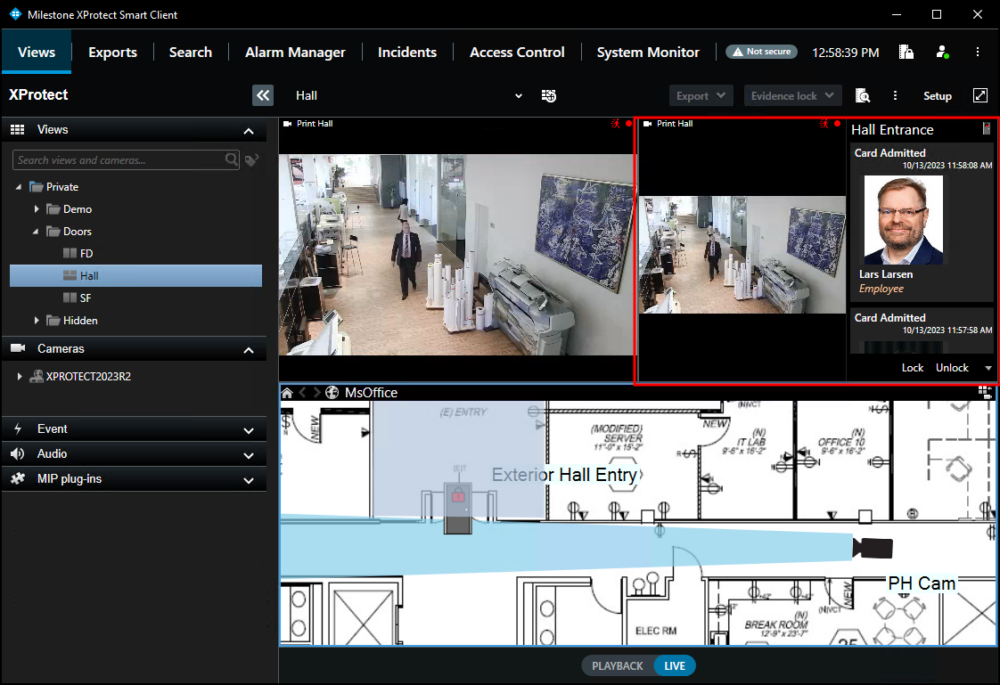

# Access monitor

The **Access Monitor** view item displays live status from doors and video from associated cameras in a single view pane in the Smart Client. Click **Setup** in the Smart Client and expand the **System Overview** panel menu. Select the **Access Monitor** view item and drag it into any available view pane:

In the **Access Monitor Settings** window, open the lists to select the door, sources, cameras, events, commands, and the order in which new events appear in the access monitor. Once the door is selected, many of the other options will change, based upon the available cameras, events, and commands. The access monitor view item can be added to any available view pane and works in a view alongside all available view items.

