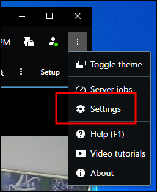
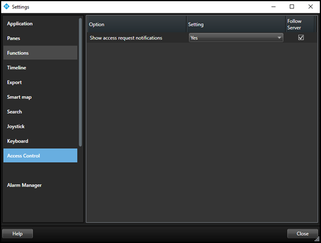

# Access control options

In the upper right corner of the Smart Client application is the **Settings and more** button. Click this button and choose **Settings** from the list.

Select the **Access Control** menu in the **Settings** window. Choose to show or block access request notifications in the Smart Client.

