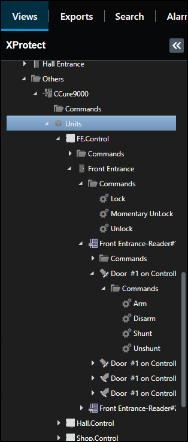
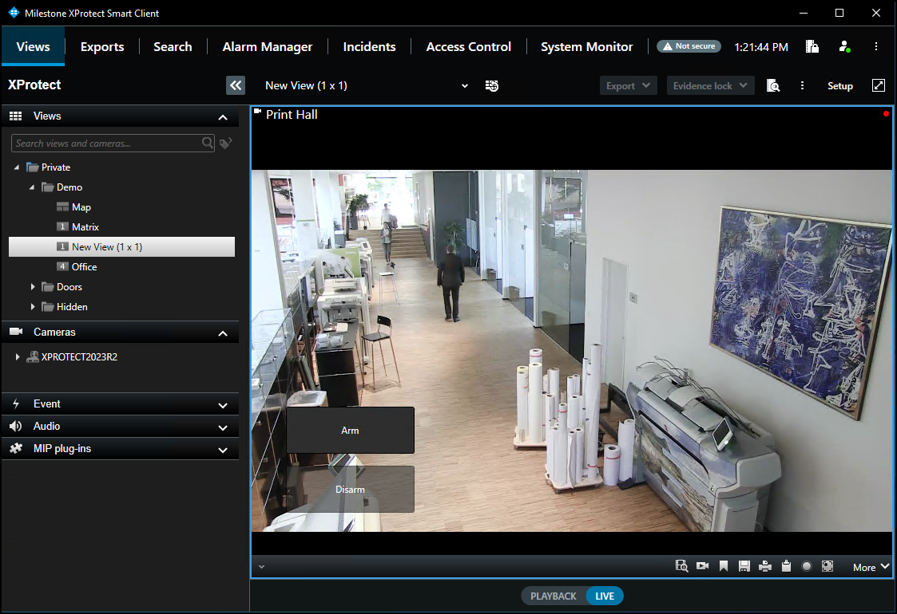

# Overlay buttons & Commands

Overlay buttons are used to add manual buttons to video panes. Anything that can be triggered by a command can be added with an overlay button in the Smart Client.

1. When the Smart Client is in setup mode, there is an **Overlay Buttons** panel on the left side of the client.
2. Select the **Access Control** icon.
3. Expand the **Access Control** icon to find all the doors and readers, panels, and the connected inputs and outputs in the system. 
     
     
4. Select a command from the list and drag it onto the view pane.
5. Once the commands are visible on a camera view pane they can be resized, moved around, and - with a right click - the name of the command can be edited. 
     
    