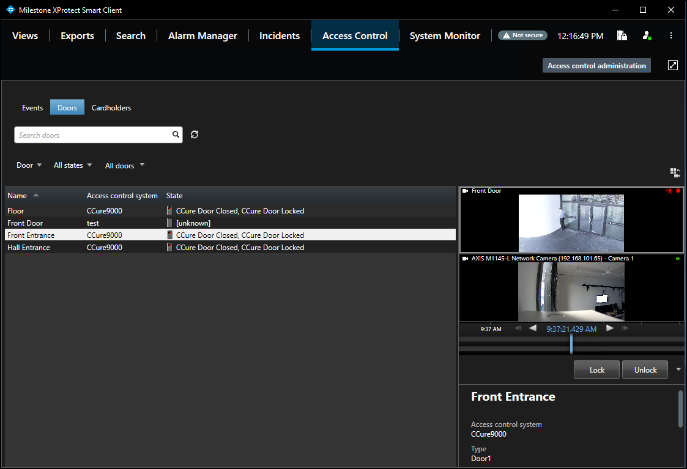
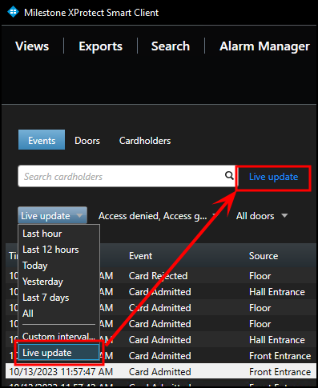
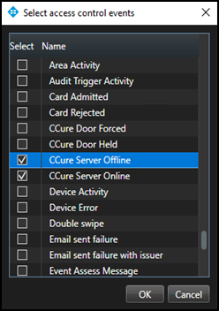
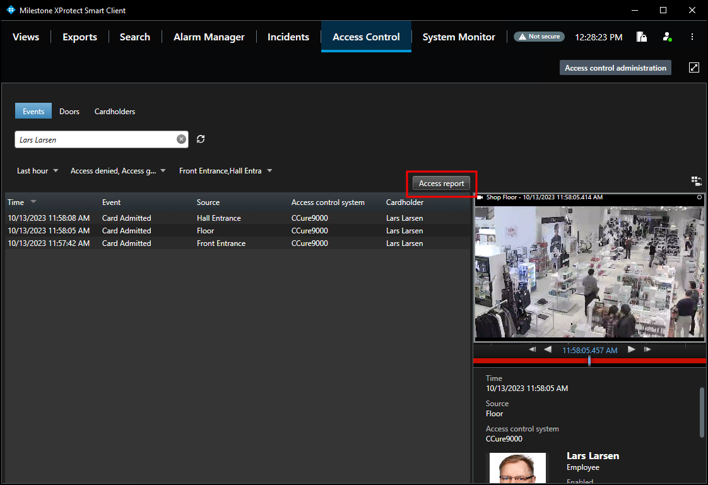
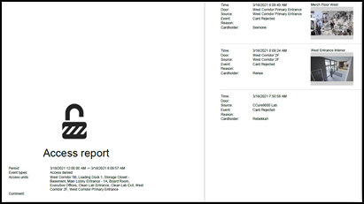
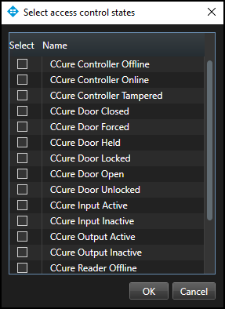
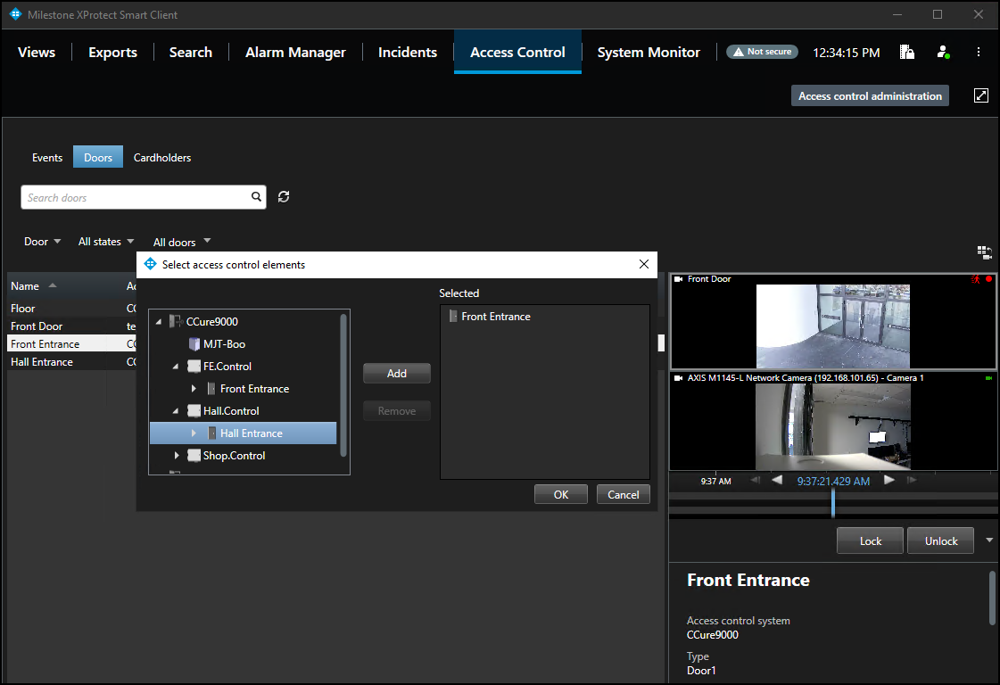
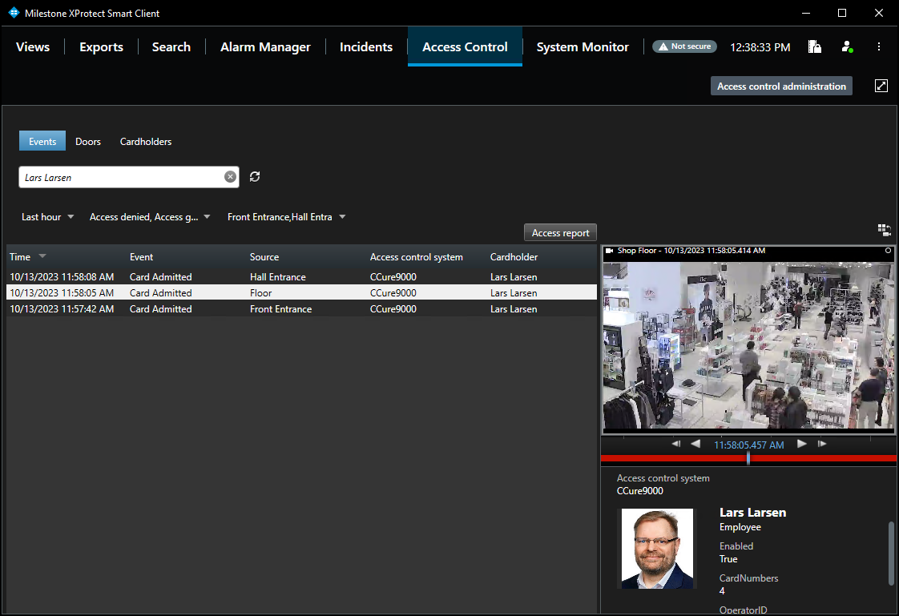

# Access control workspace explained

The XProtect Access CCure integration adds a new workspace, or tab, into the XProtect Smart Client. The **Access Control** workspace should appear in the Smart Client.

{width=75%}

This workspace is used to search and filter events, doors and cardholders.

## Events

1. Go to the **Access Control** workspace of the Smart Client and select the **Events** list.
2. Select a time range, including a custom time range, or live update. Select the **Live update** time range to view a real-time display of access control events. 
     
     
3. Filter for specific events including custom events and all integrated CCure events.
4. Open the **All** events list and select the **Access control event…** option to open the **Select access control events** window.
5. Select a specific CCure event from this list. 
     
     
6. Filter for specific hardware devices.
7. Click the **Access report** button to create a PDF file of the events in the current list. 
     
     
8. In the **Access report** window: name the report, choose a destination to save the report, include comments, and select the option to include snapshots. 
     
    

## Doors

1. Go to the **Access Control** workspace and select the **Door** list to select the type of hardware to display.
2. Select the **Access control type…** option to open the **Select access control types** window. The default option for this list is **Door**. However, servers, and readers can also be selected.
3. Open the **All states** list to filter hardware by status.
4. Select the **Access control state…** option to open the **Select access control states** window and select from the list of all available CCure hardware states. 
     
     
5. Open the **All doors** list and expand the list or select the **Other…** option to open the **Select access control elements** window. 
    + This window provides a directory of all the CCure hardware in the system. 
     
     
6. Expand the directory, find the hardware device(s), and add them to the selected list. When choosing a specific type of hardware, verify that the hardware type filter does not conflict with the chosen device(s).
7. Select a door or other type of hardware device in the list to see video from associated cameras, view status information, and command buttons available for that device.

## Cardholders

1. Go to the **Access Control** workspace of the Smart Client and select the **Cardholders** list.
2. By default, all cardholders in the system are displayed in the list.
3. Filter for specific cardholders by typing into the search field.
4. Select a cardholder to view their data.
5. Click the **View cardholder events** button to switch to the **Events** list automatically filtered to display events only from the chosen cardholder. 
     
    