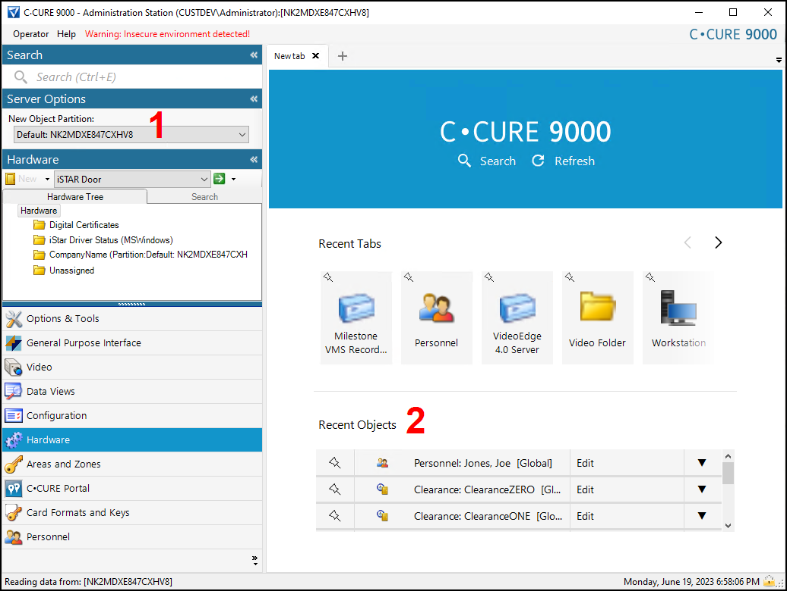
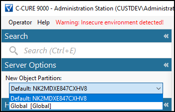
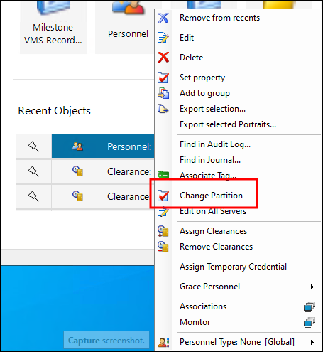

# Configuring partitions in CCure

??? warning
    The following process shows where the information about existing partitions exists within a CCure 9000 system. Please consult with your CCure representative before configuring partitions in an operational CCure system.

The default interface has several menu options that show information about current partitions.

{width=60%}

1. The **New Object Partition** menu allows filtering the client's menus, options, and user privileges based on the selected partition. 
     
     
2. Any menu option that provides the operator the ability to interact with individual objects, devices, or personnel can have options for that object's partition. 
     
     
