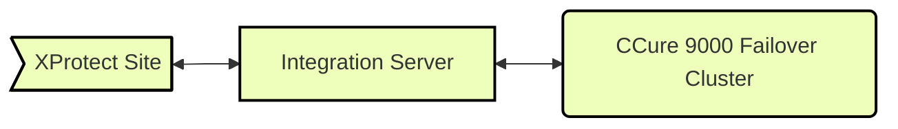
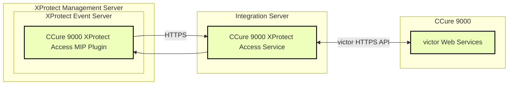

# CCure 9000: Alternate configuration

In some systems the CCure 9000 server cannot host additional software components. If the CCure 9000 software is being supported by a failover cluster, then the Milestone CCure XProtect Access Service will need to be installed on a different server in the same network, a server that we will refer to as an integration server.

In this scenario it is possible to configure the integrated system with a separate server as the host for the XProtect Access service.

**Integration server process (CCure 9000 XProtect Access Service) hosted on a separate machine.**

Failover clustering is not the only scenario that may require installing the integration components on a separate host machine. No matter the reason - redundancy, isolation of services, separation of maintenance responsibility, etc., this alternate configuration option is fully supported.

??? warning "Encrypted communications?"
    All communication and authentication between the CCure 9000 XProtect Access MIP Plugin and the CCure 9000 XProtect Access Service can be fully encrypted and secured in both directions. Please read the first topic and the second topic.