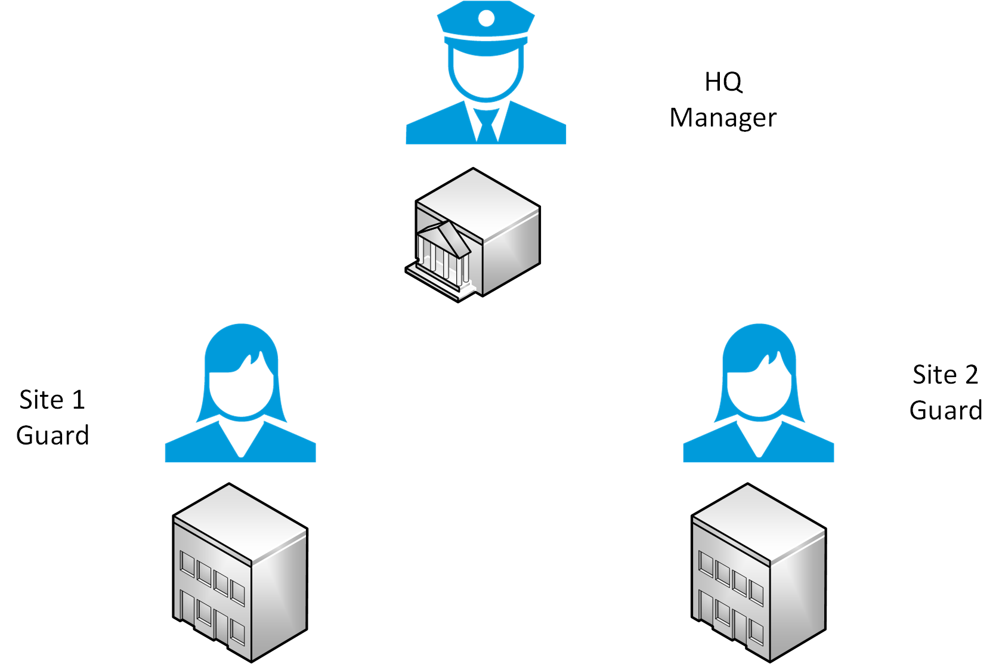
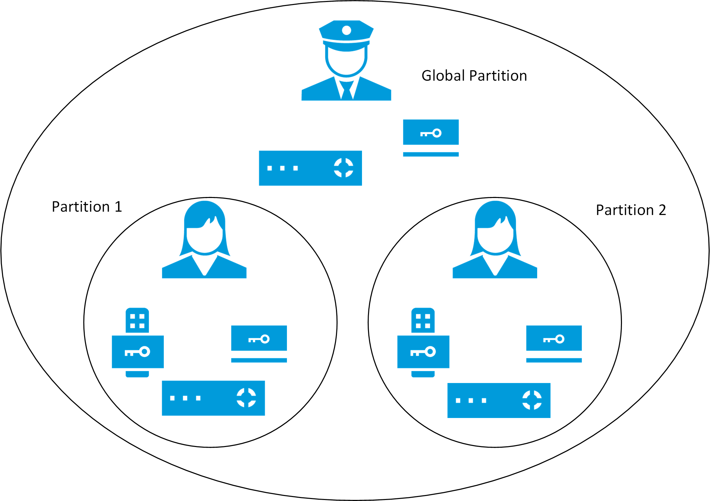

# CCure 9000 partitions (explained)

Personalized login can control which devices, events, and alarms users can view in the Smart Client when integrated with partitioned CCure 9000 systems. A partitioned CCure system uses logical groupings, known as partitions, to define which access panels, readers, cardholders, and users work together.

??? warning
    CCure 9000 requires an Enterprise CCure system to use partitions. Creating a partitioned system within CCure 9000 shouldn't be a part of installing the XProtect Access CCure integration. It's recommended to consult with an authorized CCure representative before configuring partitions or moving to an Enterprise system.

Each application server can manage a subset (one or more partitions) of the devices and personnel contained in the database.

Illustrated below is an organization with three sites, a head quarters, site 1, and site 2.

{width=40%}

Using partitions, the guard user at site 1 can  see readers, panels, and cardholders from partition 1, and the guard user from site 2 can see the devices and information from partition 2. The manager can see all devices and information, since they're in the default "Global" partition.

{width=40%}