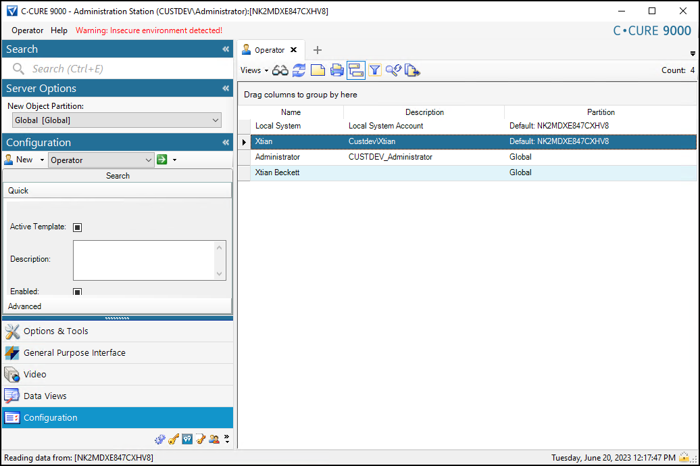

# Mapping users to partitions in CCure

1. Go to the Configuration tab in the Administration Station and search for operators in the chosen partition. 
     
    {width=60%} 
2. Add new users, Domain users, and assign partitions.

!!! glass "Recommended user configuration"
    It's recommended to map users logically from your domain, to XProtect, to CCure and to their partition. This lets SSO in XProtect work with the personalized log-in feature, and with partitions within CCure, to simplify the log-in experience, while also customizing and controlling the integrated Smart Client.
