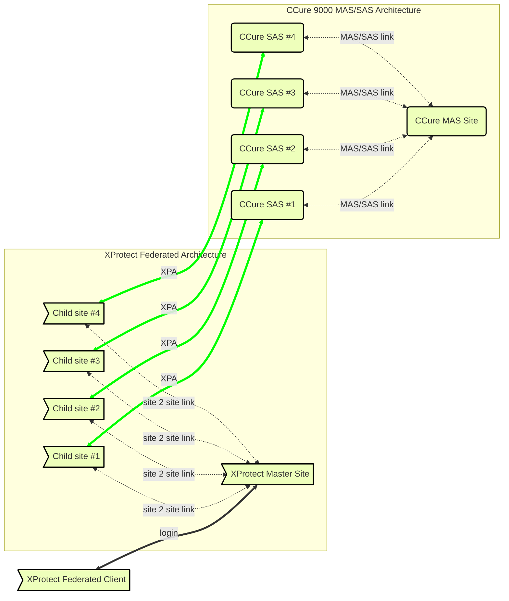

# CCure 9000: Enterprise (MAS/SAS) configuration

If the  system is part of an Enterprise deployment (MAS/SAS), the Enterprise system must be correctly configured and functioning before setting up the integration. Each  Satellite Application Server (SAS) of an Enterprise deployment must be independently connected through  (XPA) to one  Site of a Federated system.


??? warning "Unsupported MAS/SAS connection options"
    CCure 9000 Enterprise scenarios require that each CCure 9000 Satellite Application Server (SAS) installation has a maximum of one corresponding Federated XProtect site that connects to it. Each XProtect site, for performance reasons, should never have more than one CCure 9000 Satellite Application Server (SAS) connected. CCure 9000 Enterprise scenarios also require that no connection is directly made to a Master Application Server (MAS).

    **MAS-DIRECT NOT SUPPORTED**

    ```mermaid
    flowchart LR
    
        A>Single XProtect]:::XPClass <-->|XPA| B(CCure MAS Site):::XPClass
    
        linkStyle default stroke:#0f0,stroke-width:4px
        classDef XPClass fill:#f57, stroke:#000, stroke-width:2px
    ```
    **ONE-TO-MANY NOT SUPPORTED**

    ```mermaid
    flowchart RL

        A>Single XProtect]:::XPClass <-->|XPA| B(CCure Site 1):::XPClass
        A <-->|XPA| C(CCure Site 2):::XPClass
        A <-->|XPA| D(CCure Site 3):::XPClass
    
        linkStyle default stroke:#0f0,stroke-width:4px
        classDef XPClass fill:#f57, stroke:#000, stroke-width:2px
    ```