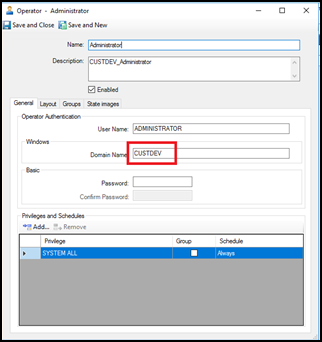
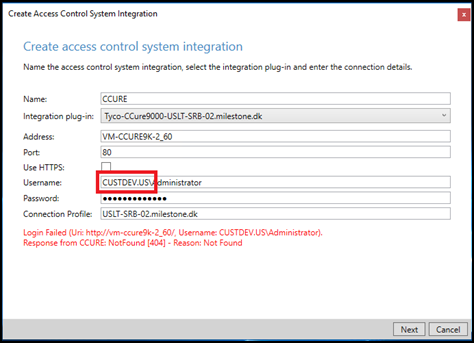

# Login fails with CCure 9000 when using a multipart domain user

The default **Operator** created during CCure 9000 installation will only retain the first part of a multipart domain name.

For example, if CCure 9000 is installed using the Administrator user on the CUSTDEV.US domain, only the CUSTDEV part of the domain will be kept in the Operator definition - the .US part will be lost.

Trying to login using the full domain name (CUSTDEV.US) won’t work.

The same exact domain name protocol must be used in both places for login to succeed.