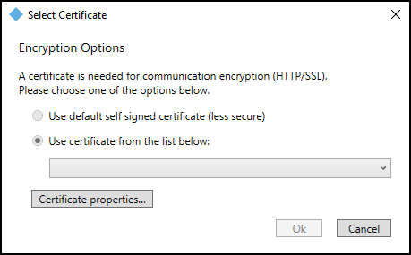
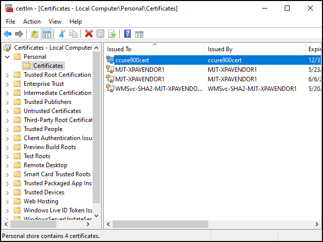

# No certificates available in Select Certificate window

After installing the XProtect Access service on the CCure 9000 server there may be no certificates available in the **Select Certificates** window. This topic explains why this can happen, and how to fix it.

1. If there are no options available to select, or simply no valid certificates for use, you may notice because both the default and third party options are unable to be selected. 
     
     
2. Check to make sure that the XProtect Access service installed on the CCure 9000 server is running. If the service hasn't started after the initial install, it won't have been able to check for available certificates.
3. It is possible that the default certificate, and any third party certificates, were removed or misplaced from the local personal certificate store. Check the local personal certificate store for certificates.
4. Run the **certlm.msc** command, expand the **Personal** folder and select the **Certificates** folder to view all available certificates. 
     
    

??? abstract "Need to create a certificate?"
    If you need to create a new self-signed certificate, or install a new third party certificate, please refer to the [XProtect VMS certificates guide](https://doc.milestonesys.com/2023r1/en-US/portal/htm/chapter-page-certificates-guide.htm).
