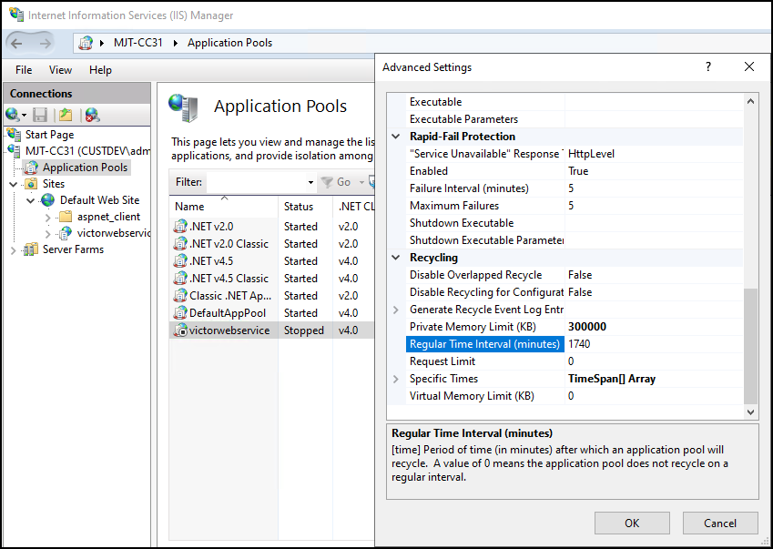
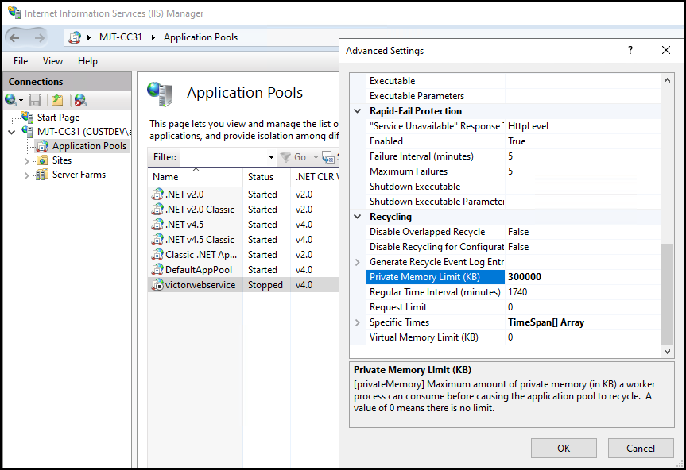

# Personalized login workarounds for integration version 1.4

Milestone and Software House have committed to maintain compatibility between all possible versions of the XProtect and CCure 9000 systems. This commitment has made it possible to install and integrate between all versions of the integrations which are posted at this [link](https://download.milestonesys.com/ccure9kxpa/CCure9000-XProtect-Access-Compatibility.pdf).

Below is a list of available workarounds required to maintain compatibility in the following combinations of software versions and feature support.

## CCure 9000 Version 2.90 SP6 or 3.00.1 and personalized login.

+ [Change victorwebservice IIS Process Private Memory Limit (KB) to 0](../Troubleshooting/PLWorkarounds.md#configure-iis-process-private-memory-limit).
+ [Change victorwebservice IIS Process Regular Time Interval (minutes) to 60-540](../Troubleshooting/PLWorkarounds.md#configure-iis-process-regular-time-interval).

!!! glass "Personalized login is not required."
    These two versions of CCure 9000 are both compatible with all supported versions of XProtect. There is only an issue with these versions when the personalized login feature is being used. If this feature is not in use, then there is no need to make any extra modifications.

## Configure IIS Process Regular Time Interval

On CCure 9000 versions 2.90SP6 and 3.00.1 the IIS process creates a memory leak when the personalized login feature is used with XProtect Access. To fix this issue it is possible to define a more frequent reboot interval for the IIS process. Below is the procedure for making this change.

1. On the CCure 9000 server, search for and open the **Internet Information Services (IIS) Manager** app.
2. Expand the host server node in the **Connections** directory and select the **Application Pools** menu.
3. Right click the **victorwebservice** application pool, and select **Advanced Settings** from the short cut menu. 
     
     
4. In the **Advanced Settings** dialog window, scroll down to the **Recycling** subsection and set the desired **Regular Time Interval (minutes)** to prevent any client login issues.
5. Click **OK**, to save the configuration, and exit the IIS Manager.

!!! glass "Recommendation"
    The default value of 1740 minutes means that the app pool only recycles, or restarts, once every 29 hours. Milestone recommends lowering the value to something that allows predictable performance expectations for the customer. In some scenarios with large systems this might be a very low value (60) in other systems, it might only need to be at the end of each shift (540).

## Configure IIS Process Private Memory Limit

On CCure 9000 version 2.90 SP6 and 3.00.1 the IIS process creates a memory leak when the personalized login feature is used with XProtect Access. To fix this issue it is recommended to remove the limit of memory the process can utilize. Below is the procedure for making this change:

1. On the CCure 9000 server, search for and open the **Internet Information Services (IIS) Manager** app.
2. Expand the host server node in the **Connections** directory and select the **Application Pools** menu.
3. Right click the **victorwebservice** application pool, and select **Advanced Settings** from the short cut menu. 
     
     
4. In the **Advanced Settings** dialog window, scroll down to the **Recycling** subsection and set the **Private Memory Limit (KB)** to zero.
5. Click **OK**, to save the configuration. Verify the victorwebservice application pool is started, and exit the IIS Manager.

