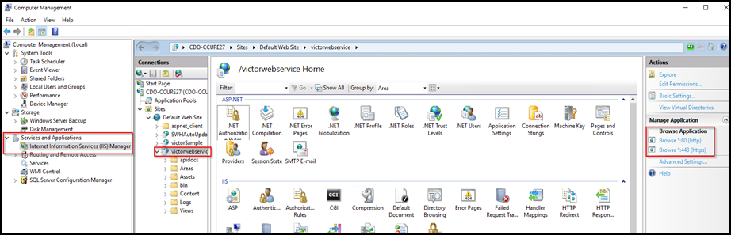
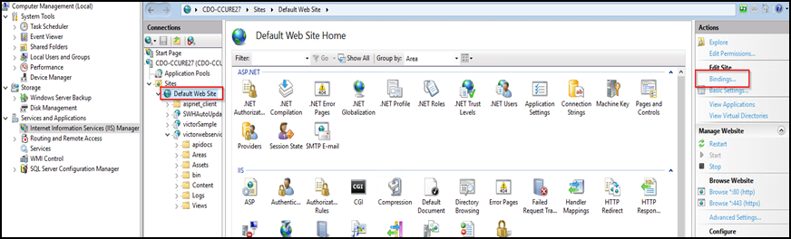
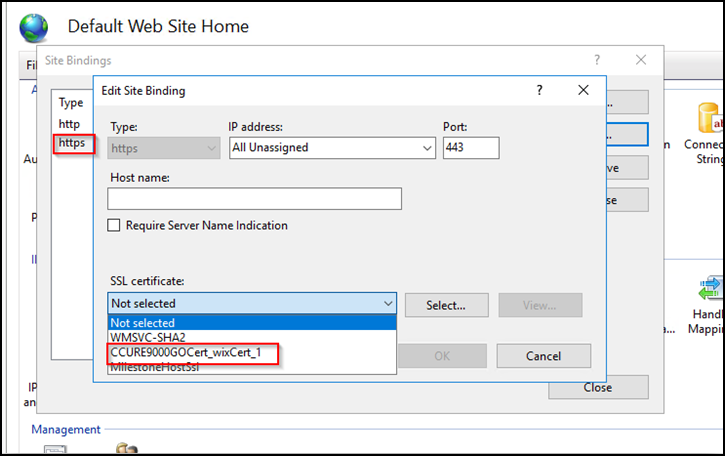

# CCure 9000 XProtect Access integration looking for secure connection with victor web service

+ This symptom should only occur with XProtect Access integrations using CCure 9000 systems which are version 2.80 or lower. Versions 2.90 and higher have fixed this issue.

A certificate must be provided and configured in IIS for the CCure 9000 victor web service to accept secure HTTPS connections on port 443. Contact CCure 9000 engineering and support resources to verify the CCure 9000 system is configured to enable secure communications.

Check if the port number (443) is configured to work with HTTPS on the CCure 9000 server. Go to the CCure 9000 server. From the **Start** menu, open the **Windows Administrative Tools** application and open the **Computer Management** menu.

Select the **Services and Applications** directory and the **Internal Information Services (IIS) Manager** menu. Expand the directory to find the **victorwebservice** website. Click on the **browse *.443** link to validate if HTTPS is working. This opens a browser and authenticates using TLS at the specified URL. If it’s blocked, the port is not setup.

To setup HTTPS on Port 443, Go to **Default Web Site** and click on **Bindings**.

Then select **https (port 443)** and click **Edit**. Open the **SSL certificate** list and select the appropriate certificate.  The certificate allows authentication using secure ports (443).

