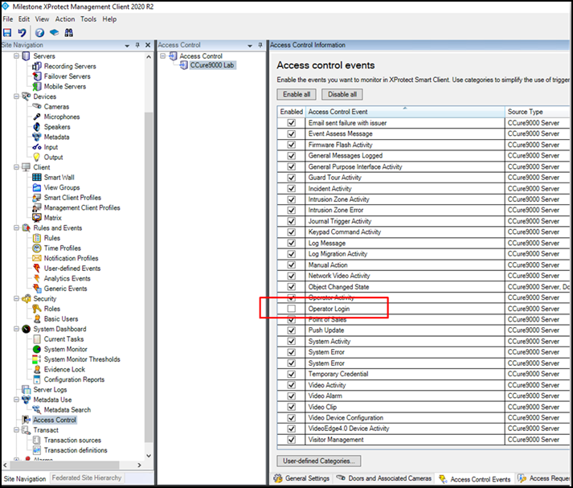

# Upgrading from 1.1 with operator login events

For integrated systems upgrading from version 1.1 of the XProtect Access plugin to the 1.3 or higher version, the default behavior of the CCure 9000 **Operator Login** event has been changed. This event was monitored by default in the 1.1 version but is not monitored by default in current versions.

To check status of this event:

1. Open the XProtect Management Client and select the **Access Control Events** tab of the XProtect Access instance.
2. Scroll down to find the event titled: **Operator Login** 
     
    

It has been observed, on some systems, that many events are generated. To avoid this behavior, the decision was made to leave this event out of the default list of events which the XProtect Access integration monitors.

However, this default behavior only changes on newly created XProtect Access instances. Therefore, if an upgraded system is receiving many operator login events and the behavior must stop being monitored, it is required to disable **Operator Login** events and save the configuration. Otherwise, this change in the default behavior will not impact an upgraded system.