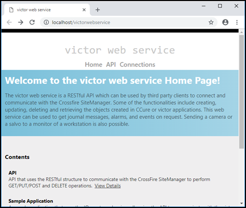
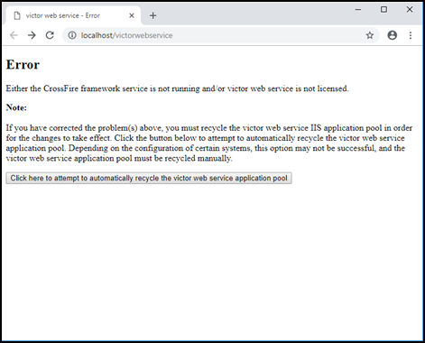

# CCure 9000 XProtect Access instance cannot communicate with CCure 9000

If XProtect is unable to authenticate or communicate with CCure 9000, there might be a problem with the CCure 9000 victor web service application pool. Follow these steps to make sure the CCure 9000 victor web service is correctly started and accepts requests:

1. Go to the CCure 9000 server.
2. Open a web browser and go the address below:</br>
    + ```http://localhost/victorwebservice/```</br>
3. If the browser opens a page similar to the one below, everything is okay with the victor web service.</br>
    </br>
    </br>
4. If the browser leads to an error message similar to the one seen below, click the button shown on the page to recycle the victor web service application pool.</br>
    </br>
    


