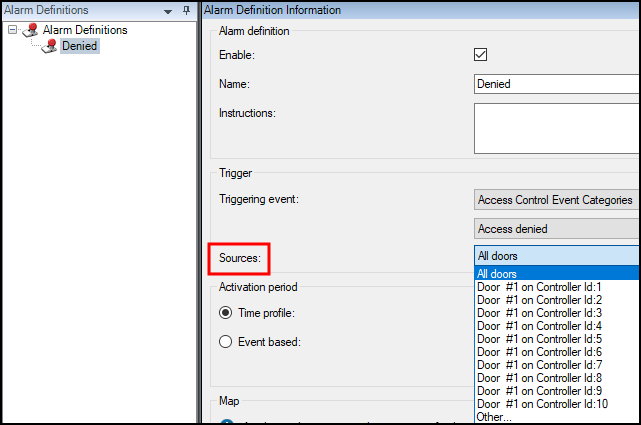

# Basic support checklist

For issues not covered in this guide, please contact Milestone Support at support@milestone.us, or by phone at 503-350-1100.

Simple items can lead to support calls if overlooked. Below is a short list of those items. First are the items to check on the XProtect Access system, followed by a list of things to verify on the CCure system. For both, make sure the versions of the CCure system and the XProtect system are [supported](https://download.milestonesys.com/ccure9kxpa/CCure9000-XProtect-Access-Compatibility.pdf).

## XProtect Access

??? abstract "Start Here"
    + Check that the doors in XProtect Access are licensed.
    + Check that the doors in XProtect Access are enabled.
    + Verify the XProtect Access Service is running. 
        + Check the service tray icon on the server where the XPA service is installed to verify.
    >
    > 
    >
    + Make sure the Event Server connection to the XPA service is connected.
    + Double check that the credentials used for the victor web service user and password fields are correct.

??? abstract "Events, alarms and status problems"
    + Verify all required doors and other devices from the CCure system are added to the XProtect Access system.
        + As devices change over time, it's suggested to refresh the configuration from the General Settings tab.
    + Check that events are displayed in the Smart Client access control workspace Events List.
        + Make sure there are no filters applied which might be changing the results.
    + Check that events are being displayed in the Management Client when the Live Events dev tab is displayed
    + Match the Source of events appearing in the Smart Client access control workspace to any Alarms defined in the Alarm Definition menu of the Management Client.
        + Smart Client event source location:
    >
    > 
    >
        + Management Client Alarm Definition source location:
    >
    > {width=75%}
    >
    + Open the log viewer application and check the following logs to verify your events are received by the XProtect Access Service:
        + XPA Translator - Event Manager Logs
            + Change the log level to Debug and Apply the change. Send some events into the system and then Open the log file.
    >
    > {width=75%}
    >
    + Open the MIP Plugin logs at this location to verify that the events are received by the Event Server:
        + C:\ProgramData\VideoOS\VideoOS.CCure9k.XPA.MipPlugin\VideoOS.Event.Server\logs
    
!!! glass "Milestone Diagnostics Tool"
    In order to have all of the log information that might be required to help troubleshoot event issues, it is recommended to use the Milestone Diagnostics Tool. Read about how to use this tool, and how to gather log data, [here](https://doc.milestonesys.com/latest/en-US/portal/htm/chapter-page-diagnostics-tool.htm?tocpath=Tools%20%2526%20Architecture%7CMilestone%20Diagnostics%20Tool%7C_____0" title="Milestone Diagnostics Tool).

## CCure 9000

+ Check that the required CCure 9000 services are running. Open the Server Configuration Application and check that these services are **Running**. 
    + CrossFire Framework Service
    + CrossFire Server Component Framework Service
    + SoftwareHouse CrossFire iSTAR Driver Service 
    {width=75%} 
+ Verify the victor web service is running.

!!! glass "Advanced"
    It is also possible to obtain victor web service SDK samples which can be used to test and validate the performance of the CCure integration. These samples, and the SDK itself can be downloaded from the CCure 9000 [Connected Partner Program](https://www.swhouse.com/partners/) portal. Once logged into the portal download the Partner Package for the version of CCure you have installed, and the SDK and the samples will be included.